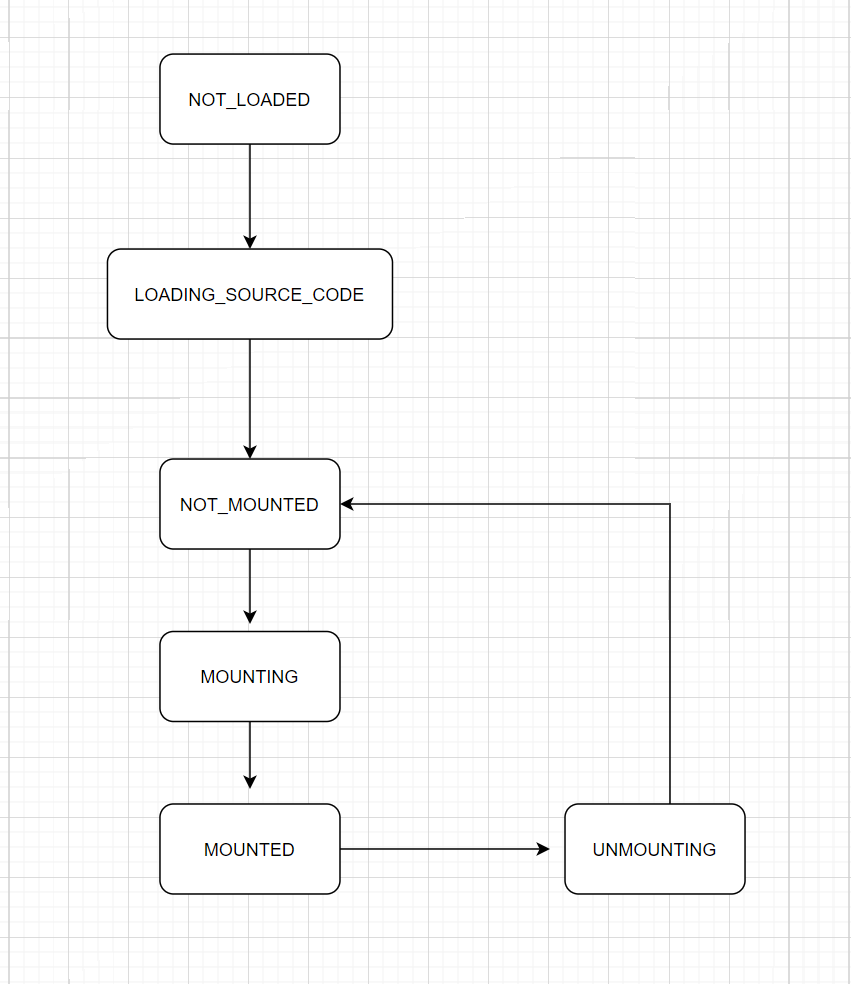

# 微前端架构的实现及应用

## 现有问题回顾

1. 随着项目的迭代，功能堆积的越来越多，产品在设计上并没有考虑按功能分割出不同应用，导致工程越来越大(Frontend Monolith)，测试打包部署都需要很长时间；有时一个很小的bug修复却要打包其他无关的模块。

2. 有时想在独立的新功能上应用新技术，但由于包的升级或者引入新技术会影响老旧的模块而不得不做出妥协。

3. 如果自己模块因为某些原因要回退到某个历史版本，不能简单的回退因为中间会有其他模块的代码merge进来。

4. ... ...

如果将大应用按照某种标准拆分成若干个小应用，每个应用都能独立开发独立部署，再由一个主应用去管理这些子应用，那上面这些问题都能解决。
## 微前端是什么
微前端的概念最早在2016年底由[ThoughtWorks Technology Radar](https://www.thoughtworks.com/radar/techniques/micro-frontends)提出，它是微服务架构在前端领域的延申。微前端的想法是根据功能构建出由独立团队维护的网站或web应用；每个团队都有自己擅长的业务领域；并且能跨职能地、端对端地开发从数据库到UI界面的多种功能。

但是这个想法并不新鲜。它和[ Self-contained Systems concept](http://scs-architecture.org/)(独立系统)有许多共同点。在过去，这种想法被称为[ Frontend Integration for Verticalised Systems](https://dev.otto.de/2014/07/29/scaling-with-microservices-and-vertical-decomposition/)(垂直系统的前端集成)。显然微前端是一个更友好简洁的表述。[1]

WEB架构的演进


## 微前端的几种实现形式

1. 路由分发式

路由分发式前端，即通过路由将不同的业务分发到不同的独立前端应用上。其通常可以通过HTTP服务器的反向代理来实现，或者通过应用框架自带的路由来解决。

当前而言，路由分发式的架构是采用得最多、最容易的“微前端”方案。它只是将这些不同的前端应用拼凑到一起，让他们看起来像一个完整的整体。每当用户从A应用转换到B应用的时候，往往需要刷新一下页面、重新加载资源文件。

在这个架构中，我们只需要关注应用间的数据传递方式。通常，我们只需要将当前的用户状态，从A应用传递到B应用即可。如果两个应用在同一个域中，可以通过LocalStorage、Cookies、IndexedDB等方式共享数据。

在采用这种应用时，缺少了对应用状态的处理，需要用户重新登录，这种体验对用户来说相当不友好

2. 组合式集成

微应用化是指，在开发时应用都是以单一、微小应用的形式存在的，而在运行时，则通过构建系统合并这些应用，并组合成一个新的应用。

微应用化大都是以软件工程的方式来完成前端应用的开发的，因此又称之为组合式集成。

对于一个大型的前端应用来说，采用的架构方式往往是通过业务作为主目录的，然后在业务目录中放置相关的组件，同时拥有一些通用的共享模板

3. 微件化

微件(Widget)，是一段可以直接嵌入应用上运行的代码，它由开发人员预先编译好，在加载时不需要再做任何修改或编译。

微前端下的微件化是指，每个业务团队编写自己的业务代码，并将编译好的代码部署到指定的服务器上。在运行时，我们只需要加载相应的业务模块即可。

在非单页面应用时代，要实现微件化方案是一件特别容易的事。从远程加载JavaScript代码并在浏览器上执行，生成对应的组件嵌入页面。

为了支持微件化，需要做下面这些事情：

(1) 持有一个完整的框架运行时及编译环境。这用于保证微件能正常使用，即可调用框架API等。
(2) 性能受影响。应用由提前编译变成运行时编译，会造成一些性能方面的影响
(3) 提前规划依赖。如果一个新的微件想使用新的依赖，需要从上游编译引入。
此外，还需要一个支持上述功能的构建系统，它用于构建一个独立的微件模块。这个微件的形式如下：

分包构建出来的独立代码，如webpack构建出来的chunk文件

4. 前端容器：iframe

iframe能有效地将另一个网页/单页面应用嵌入到当前页面中，两个页面间的CSS和JavaScript是相互隔离的。iframe相当于创建了一个全新的独立的宿主环境，类似于沙箱隔离，它意味着前端应用之间可以相互独立运行。

但是每次切换子应用时，很难路由到子应用的子路由

5. 前端微服务化

前端微服务化，是微服务架构在前端的实施，每个前端应用都是完全独立（技术栈、部署、构建独立）、自主运行的，最后通过模块化的方式组合出完整的前端应用。

当我们单击指向某个应用的路由时，会加载、运行对应的应用。而原有的一个或多个应用，仍然可以在页面上保持运行的状态。这些应用可以使用不同的技术栈开发，如页面上可以同时运行React、Angular和Vue框架开发的应用。

实施的原因是基于现有的前端框架都离不开基本的HTML元素DOM。所以只需要做到以下两点：

(1) 在页面合适的地方引入或者创建DOM

(2) 用户操作时，加载对应的应用（触发应用的启动），并能卸载应用

## 微前端的实现

综上，我们来具体描述一下想要实现的微前端架构：

* 有一个基座应用，这个应用的作用是管理子应用，包括子应用的注册、加载、更新和卸载。基座应用提供容器来加载一个或多个子应用。并且基座应用能加载的子应用与子应用的技术栈无关。

* 既然基座的实现与子应用无关，那么子应用应该自己定义触发加载，渲染和卸载的方法，并把方法暴露给基座调用(基座和子应用之间协商)

* 上面两条基本实现了核心功能，但是还有问题需要解决。在浏览器里，这个问题是CSS隔离和JS隔离。等我们实现核心功能再来看隔离问题。

现在我们就来设计一个库来帮助实现应用管理。

### API设计

首先我们不妨先定义基座和子应用各自的功能范围和之间的协议。类似react库和组件，基座应用负责维护子应用的生命周期。

规定以下协议：

1. 子应用提供mount和unmount方法，用以把应用加载和卸载到#subApp1的容器中，技术栈与基座无关；基座应用仅提供#subApp1的槽位；

2. 基座应用负责注册应用，适时调用子应用的mount和unmount方法

开始我们有两个核心的方法来注册和启动应用

registerApplicatino方法传入应用名字 load函数，触发条件和自定义props

load函数依照和子应用的协议，子应用会暴露出bootstrap mount和unmount等方法供基座调用。

我们以子应用是react为例，假设该应用打包后生成umd规范的bundle.js,导出内容挂到window.app1Library的对象中；并将应用渲染到基座应用id为subApp1的容器里。基座应用可以通过加载bundle.js的方式拿到挂载在app1Library上的mount unmount方法。

伪代码如下：

基座应用html
```html
<body>
  <!-- 基座应用本身的容器 -->
  <div id="root"></div>

  <!-- 子应用各自的容器 -->
  <div id="subApp1"></div>
  <div id="subApp2"></div>
  <div id="subApp3"></div>
  ...
</body>
```

子应用暴露方法
```javascript
function mount() {
  reactDom.render(<App />, document.getElementById('#subApp1'))
}
function unmount() {

}

function bootstrap() {

}

export { mount, unmount bootstrap };

```

基座应用注册和加载子应用
```javascript
const { registerApplication, start } = import('myMicro');
registerApplication(
  appName: 'subApp1',
  async () => {
    await loadScript('http://domain.name.com/js/bundle.js')
    await loadScript('other js file')
    const { bootstrap, mount, unmount } = window.app1Library;
    return {
      bootstrap, mount, unmount
    };
  },
  (location) => {
    return location.pathname.startWith('/subApp1');
  },
  {
    ...customProps,
  }
);
```

### 内部实现-定义应用的生命周期
一个应用从注册到加载到挂载再到卸载，主要的生命周期为




registerApplication


https://www.jianshu.com/p/41ab812df9e7

https://segmentfault.com/a/1190000022643178


## 参考文献
[1] [Micro Frontends](https://micro-frontends.org/#:~:text=The%20term%20Micro%20Frontends%20first%20came%20up%20in,sits%20on%20top%20of%20a%20micro%20service%20architecture)